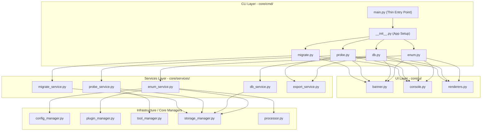

# SubX — Developer Documentation

> Internal reference for developing, maintaining, and extending the SubX subdomain recon framework.
> Updated to reflect the clean, service-oriented layered architecture.

---

## Table of Contents

1. [Architecture Overview](#architecture-overview)
2. [Project Directory Structure](#project-directory-structure)
3. [Architecture Layers & File Roles](#architecture-layers--file-roles)
   - [CLI Layer (`core/cmd/`)](#1-cli-layer-corecmd)
   - [Services Layer (`core/services/`)](#2-services-layer-coreservices)
   - [UI Layer (`core/ui/`)](#3-ui-layer-coreui)
   - [Infrastructure & Managers](#4-infrastructure--managers)
4. [Data Models](#data-models)
5. [How to Write a Plugin](#how-to-write-a-plugin)
6. [How to Add an External Tool (Wrapper)](#how-to-add-an-external-tool-wrapper)
7. [Database Schema & Migrations](#database-schema--migrations)
8. [Testing Plugins and Tools](#testing-plugins-and-tools)
9. [Common Development Recipes](#common-development-recipes)

---

## Architecture Overview

SubX is structured using a clean, decoupled, layered architecture:



### Layering Rules

To keep the architecture clean and maintainable, follow these import rules:
* **CLI commands (`core/cmd/*`)** can import from **Services** (`core/services/*`) and **UI** (`core/ui/*`). They must **never** instantiate or directly call infrastructure managers (like `StorageManager` or `PluginManager`).
* **Services (`core/services/*`)** own the business logic and coordinate the infrastructure components. They can import from `core/storage_manager.py`, `core/plugin_manager.py`, etc. They must **never** import from UI or CLI layers.
* **UI (`core/ui/*`)** is pure rendering and layout logic. It can import from `core/models.py` for type definitions. It must **never** import from CLI, Services, or perform I/O / DB queries.

### Optimization & Dependency Rules

To keep the framework lightweight, modular, and optimized:
* **Prefer Async Network Clients (`aiohttp`)**: Do not use synchronous HTTP libraries (like `requests` or client SDKs built on top of them) in new plugins. All passive query engines must perform network queries asynchronously.
* **Keep Dependencies Minimal**: Do not introduce heavy third-party packages (e.g., visualization libraries like `networkx`, `pyvis`, or parser packages like `feedparser`) unless they are core to the reconnaissance pipeline.
* **Keep Wrappers Pure**: Tool wrappers in `tools/` must only handle subprocess execution, input data streaming, and output parsing. They must not carry database logic.

---

## Project Directory Structure

```
SubX/
├── main.py                        # Thin CLI entry point
├── pyproject.toml                 # Package definition & console script
├── setup.py                       # Setuptools installation metadata
├── config.yaml                    # Active runtime configuration
├── config_samples/                # Templates and examples of config files
├── core/                          # Framework Core
│   ├── cmd/                       # CLI Command definitions (Typer routes)
│   │   ├── __init__.py            # Typer app initialization and registration
│   │   ├── base.py                # Abstract base class Command for CLI subcommands
│   │   ├── enum.py                # "subx enum" route
│   │   ├── db.py                  # "subx db" route
│   │   ├── probe.py               # "subx http-probe" route
│   │   └── migrate.py             # "subx dev-migrate" route
│   ├── services/                  # Business Logic layer
│   │   ├── __init__.py            # Service package re-exports
│   │   ├── enum_service.py        # Orchestrates subdomain enumeration
│   │   ├── db_service.py          # Interface for database actions
│   │   ├── probe_service.py       # Orchestrates HTTP liveness probing
│   │   ├── migrate_service.py     # Schema migrations orchestrator
│   │   └── export_service.py      # Output file writing and parsing helpers
│   ├── ui/                        # User Interface and rich formatting
│   │   ├── __init__.py            # UI package re-exports
│   │   ├── banner.py              # Print ascii banners
│   │   ├── console.py             # Setup Rich Console and message logs
│   │   └── renderers.py           # Functions to display tables, summary panels
│   ├── config_manager.py          # Config file parses + API key parser
│   ├── db_models.py               # SQLModel db schema
│   ├── logger.py                  # Standard logger configuration
│   ├── models.py                  # Dataclasses (PluginResult, ProcessedResult)
│   ├── plugin.py                  # Base class for passive/active plugins
│   ├── plugin_manager.py          # Plugin scanning, load, and concurrent execute
│   ├── processor.py               # Domain classification (scope / wildcard)
│   ├── storage_manager.py         # Database CRUD (async SQLModel wrapper)
│   ├── tool.py                    # Base class for external binary tools (e.g. httpx)
│   └── tool_manager.py            # Connects DB input/outputs to running tools
├── plugins/                       # Subdomain Enumeration Plugins
│   ├── crtsh_enum.py              # Cert transparency logs (no API key)
│   ├── shodan_enum.py             # Shodan resolver (requires API key)
│   └── ... (other passive plugins)
├── tools/                         # External Command wrappers
│   └── httpx.py                   # httpx tool wrapper definition
├── bin/                           # Bundled Windows binaries (win32 only)
│   └── httpx/
│       └── httpx.exe
└── tests/                         # Module and integration test scripts
```

---

## Architecture Layers & File Roles

### 1. CLI Layer (`core/cmd/`)

Handles parsing command-line parameters, managing flags, and triggering high-level processes. It passes structured results to the UI layer.

* **[main.py](file:///c:/Users/DELL/PycharmProjects/SubX/main.py)**: Thin bootstrapper. It imports the Typer app from `core/cmd/__init__.py` and executes it.
* **[__init__.py](file:///c:/Users/DELL/PycharmProjects/SubX/core/cmd/__init__.py)**: Instantiates the Typer `app` and registers the subcommand class instances.
* **[base.py](file:///c:/Users/DELL/PycharmProjects/SubX/core/cmd/base.py)**: Defines the `Command` abstract base class with common command properties, generic registration, and setup helpers.
* **[enum.py](file:///c:/Users/DELL/PycharmProjects/SubX/core/cmd/enum.py)**: Defines the `EnumCommand` class wrapping subdomain enumeration. Invokes `EnumService`.
* **[db.py](file:///c:/Users/DELL/PycharmProjects/SubX/core/cmd/db.py)**: Defines the `DbCommand` class wrapping database summary, queries, and deletion. Invokes `DbService`.
* **[probe.py](file:///c:/Users/DELL/PycharmProjects/SubX/core/cmd/probe.py)**: Defines the `ProbeCommand` class wrapping HTTP status and title probing. Invokes `ProbeService`.
* **[migrate.py](file:///c:/Users/DELL/PycharmProjects/SubX/core/cmd/migrate.py)**: Defines the `MigrateCommand` class wrapping SQLite schema migrations. Invokes `MigrateService`.

### 2. Services Layer (`core/services/`)

Contains the core business logic. Coordinates database writes, runs processes, handles errors, and returns clean Python objects.

* **[enum_service.py](file:///c:/Users/DELL/PycharmProjects/SubX/core/services/enum_service.py)**: Loads scope files, runs configured plugins in parallel, merges wildcards, filters out-of-scope targets, and persists findings using `StorageManager`.
* **[db_service.py](file:///c:/Users/DELL/PycharmProjects/SubX/core/services/db_service.py)**: Exposes functions to select targets summaries, fetch subdomains by source/date, execute raw SQL queries, and purge tables safely.
* **[probe_service.py](file:///c:/Users/DELL/PycharmProjects/SubX/core/services/probe_service.py)**: Coordinates external network probing. It queries database rows, runs `HttpxTool` via `ToolManager`, and loads updated status models.
* **[migrate_service.py](file:///c:/Users/DELL/PycharmProjects/SubX/core/services/migrate_service.py)**: Coordinates DB validation, backup creation, and incremental columns updates.
* **[export_service.py](file:///c:/Users/DELL/PycharmProjects/SubX/core/services/export_service.py)**: Universal I/O handlers. Parses formatting separators and writes domain lines to output files.

### 3. UI Layer (`core/ui/`)

Implements user-facing elements using [Rich](https://rich.readthedocs.io/).

* **[banner.py](file:///c:/Users/DELL/PycharmProjects/SubX/core/ui/banner.py)**: Contains `banner()`, which displays the ASCII branding.
* **[console.py](file:///c:/Users/DELL/PycharmProjects/SubX/core/ui/console.py)**: Provides uniform colored indicators: `info` (blue), `success` (green), `warn` (yellow), and `error` (red, with program exit).
* **[renderers.py](file:///c:/Users/DELL/PycharmProjects/SubX/core/ui/renderers.py)**: Formats database dashboards, passive enumeration results, wildcard breakdowns, HTTP probe counts, and query grids into styled Rich tables and panels.

### 4. Infrastructure & Managers

Low-level components that communicate with the file system, network, or database.

* **[config_manager.py](file:///c:/Users/DELL/PycharmProjects/SubX/core/config_manager.py)**: Parses yaml configuration and reads `.env` variables.
* **[plugin_manager.py](file:///c:/Users/DELL/PycharmProjects/SubX/core/plugin_manager.py)**: Discovers `Plugin` subclasses and runs their `run()` methods asynchronously.
* **[tool_manager.py](file:///c:/Users/DELL/PycharmProjects/SubX/core/tool_manager.py)**: Fetches lists of stored hosts, runs a `Tool` subclass, and updates the database.
* **[storage_manager.py](file:///c:/Users/DELL/PycharmProjects/SubX/core/storage_manager.py)**: Encapsulates SQLModel session management for SQLite.
* **[processor.py](file:///c:/Users/DELL/PycharmProjects/SubX/core/processor.py)**: Classifies subdomains (wildcard, in-scope, out-of-scope).

---

## Data Models

SubX uses two in-memory dataclasses to track scan results, and a SQLModel class for database storage.

### `PluginResult`
**File:** `core/models.py`
Represents the output of a single plugin run.
* `plugin_name` (`str`): Class name of the plugin.
* `subdomains` (`list[str]`): List of discovered domains.
* `error` (`Exception | None`): Any error encountered during execution.
* `finished_at` (`datetime`): UTC completion timestamp.

### `ProcessedResult`
**File:** `core/models.py`
Consolidated and deduplicated outputs across all plugins.
* `by_plugin` (`dict[str, list[str]]`): Subdomains mapped to their discovering plugin.
* `wildcards` (`list[str]`): Discovered wildcard roots (without `*.`).
* `out_of_scope` (`list[str]`): Subdomains filtered out of scope.
* `all_subdomains` (`list[str]`): Flat, unique, sorted list of all in-scope subdomains.

### `Subdomain` (DB Table)
**File:** `core/db_models.py`
The SQLite database model definition.
* `id` (`int` PK): Autoincrement primary key.
* `target` (`str` Index): Root target domain (e.g. `example.com`).
* `subdomain` (`str` Index): Discovered subdomain (e.g. `api.example.com`).
* `source_plugin` (`str`): The plugin that discovered it.
* `alive` (`bool | None`): HTTP liveness status.
* `status_code` (`int | None`): HTTP response code.
* `title` (`str | None`): HTTP HTML title.
* `first_seen` (`datetime`): Discovery timestamp.
* `last_seen` (`datetime`): Last scan confirmation timestamp.

---

## How to Write a Plugin

SubX plugins are auto-discovered at runtime. To add a plugin:

1. Create a new python file in `plugins/` (e.g., `plugins/my_source_enum.py`).
2. Define a class inheriting from `core.plugin.Plugin`.
3. Set your class name to end with `Plugin` (e.g., `MySourcePlugin`).
4. Implement `async def run(self, domain: str) -> list[str]`.

### Example 1: Minimal Plugin (No API Key Required)

```python
import aiohttp
from core.plugin import Plugin

class MySourcePlugin(Plugin):
    """Enumerate subdomains using MySource API (no authentication)."""

    async def run(self, domain: str) -> list[str]:
        url = f"https://api.mysource.com/subdomains?domain={domain}"
        subdomains = []

        try:
            # Always use aiohttp for async network I/O
            async with aiohttp.ClientSession() as session:
                async with session.get(url, timeout=15) as resp:
                    if resp.status == 200:
                        data = await resp.json()
                        subdomains = data.get("results", [])
                    else:
                        self.logger.warning("Received status code %d", resp.status)
        except Exception as e:
            self.logger.error("API request failed: %s", e)

        return subdomains
```

### Example 2: Authenticated Plugin (API Key Required)

If your plugin requires an API key, override the `required_keys` property to specify the configuration keys:

```python
import aiohttp
from core.plugin import Plugin

class SecuredServicePlugin(Plugin):
    """Enumerate subdomains using a secured API endpoint."""

    @property
    def required_keys(self) -> list[str]:
        # These keys must match the entries under api_keys in config.yaml
        return ["SECURE_SERVICE_API_KEY"]

    async def run(self, domain: str) -> list[str]:
        api_key = self.config.get("SECURE_SERVICE_API_KEY")
        headers = {"Authorization": f"Bearer {api_key}"}
        subdomains = []

        try:
            async with aiohttp.ClientSession(headers=headers) as session:
                url = f"https://api.secure.io/v1/dns?target={domain}"
                async with session.get(url, timeout=20) as resp:
                    if resp.status == 200:
                        data = await resp.json()
                        subdomains = [item["host"] for item in data.get("records", [])]
        except Exception as e:
            self.logger.error("Failed to query secure service: %s", e)

        return subdomains
```

Then add your key to `config.yaml`:
```yaml
api_keys:
  SECURE_SERVICE_API_KEY: "your_api_token"
```

---

## How to Add an External Tool (Wrapper)

External tools wrapper handle calls to command-line binaries (e.g. `httpx`, `naabu`, `nuclei`) by feeding them lists of targets and parsing their stdout.

### 1. Create the Tool Wrapper Class
Create a new file in `tools/` (e.g., `tools/portscanner.py`) inheriting from `core.tool.Tool`.

```python
import json
from core.tool import Tool, ToolNotFoundError, ToolExecutionError

class PortScanTool(Tool):
    """Wrapper for port scanning tool (e.g., naabu)."""

    TOOL_NAME = "naabu"

    async def run(self, targets: list[str], timeout: int = 300) -> list[dict]:
        if not targets:
            return []

        # Convert targets to a newline-separated string
        input_data = "\n".join(targets) + "\n"

        # Execute using the self._execute helper (handles process creation, stdin, timeouts)
        try:
            stdout, stderr = await self._execute(
                ["-json", "-silent"],
                input_data=input_data,
                timeout=timeout
            )
        except ToolNotFoundError:
            self.logger.error("Binary not found. Please install naabu.")
            raise

        # Parse standard output lines
        results = []
        for line in stdout.splitlines():
            if not line.strip():
                continue
            try:
                data = json.loads(line)
                # Ensure each parsed dict contains a "subdomain" key matching the target
                results.append({
                    "subdomain": data.get("host"),
                    "open_ports": data.get("ports", [])
                })
            except json.JSONDecodeError:
                continue

        return results
```

### 2. Configure Binary Path Resolution
The `Tool` class handles paths differently based on the OS (implemented in `core/tool.py`):
* **Windows**: Looks for a bundled executable at `bin/<tool_name>/<tool_name>.exe`.
* **Linux / macOS**: Looks up the binary name in the system environment `PATH`.

If you are bundling a Windows version of the scanner, create the corresponding subfolder and place the executable inside:
```
SubX/
└── bin/
    └── naabu/
        └── naabu.exe
```

---

## Database Schema & Migrations

### Current Schema
Defined in `core/db_models.py`.

```sql
CREATE TABLE subdomain (
    id            INTEGER PRIMARY KEY AUTOINCREMENT,
    target        TEXT NOT NULL,
    subdomain     TEXT NOT NULL,
    source_plugin TEXT NOT NULL,
    alive         BOOLEAN,
    status_code   INTEGER,
    title         TEXT,
    first_seen    TIMESTAMP NOT NULL,
    last_seen     TIMESTAMP NOT NULL
);
CREATE INDEX ix_subdomain_target ON subdomain (target);
CREATE INDEX ix_subdomain_subdomain ON subdomain (subdomain);
```

### Adding New Fields to the DB Model

1. **Modify the Class**: Open `core/db_models.py` and add the new attribute as a nullable field:
   ```python
   class Subdomain(SQLModel, table=True):
       # ...
       open_ports: str | None = Field(default=None)
   ```

2. **Trigger the Migration**: Run the migration command:
   ```bash
   uv run python main.py dev-migrate
   ```
   This command creates a timestamped backup of your database (`subx.backup-<timestamp>.db`), inspects existing columns, and adds any missing columns using `ALTER TABLE`.

---

## Testing Plugins and Tools

Write a testing script inside `tests/` directory (e.g. `tests/test_my_plugin.py`). This allows testing changes without running the full CLI workflow.

### Testing a Plugin
```python
# tests/test_my_plugin.py
import asyncio
from plugins.my_source_enum import MySourcePlugin

async def test():
    # Pass simulated configurations directly
    plugin = MySourcePlugin({"MY_API_KEY": "dummy_value"})
    subdomains = await plugin.run("example.com")
    print(f"Discovered: {len(subdomains)} items")
    for sub in subdomains[:10]:
        print(f" - {sub}")

if __name__ == "__main__":
    asyncio.run(test())
```

### Testing a Tool
```python
# tests/test_my_tool.py
import asyncio
from tools.httpx import HttpxTool

async def test():
    tool = HttpxTool()
    results = await tool.run(["google.com", "github.com"])
    for r in results:
        print(r)

if __name__ == "__main__":
    asyncio.run(test())
```

---

## Common Development Recipes

### Orchestrating Processes via Services
If you need to query database entries, execute migrations, or run scans from external code, use the **service classes** instead of calling the raw storage classes:

```python
import asyncio
from core.services.db_service import DbService
from core.services.probe_service import ProbeService

async def script():
    db = DbService()
    probe = ProbeService()
    
    # 1. Fetch domain statistics
    summaries = await db.get_summary()
    for summary in summaries:
        print(f"{summary['target']}: {summary['count']} subdomains")
        
    # 2. Run liveness prober
    print("Probing hackerone.com...")
    raw_probe_outputs, updated_rows = await probe.probe_domain("hackerone.com")
    print(f"Probed {len(updated_rows)} domains.")

if __name__ == "__main__":
    asyncio.run(script())
```
